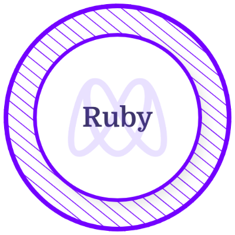

<h1 align="center"> Hi there👋, I'm Ermiyas Demsew</h1>
<h3 align="center">A Software Developer and Mechanical Engineer from Ethiopia</h3>

I am a highly skilled full stack developer with expertise in a range of technologies including HTML, CSS, JavaScript, React, Redux, PostgreSQL, Ruby, and Ruby on Rails. With several years of experience in web development, I am passionate about building robust and engaging web applications. My strong foundation in front-end development allows me to create responsive and intuitive user interfaces that enhance the user experience. On the back-end, I am talented in managing complex databases and designing effective technical solutions.

---

<!--    -->
  
  <!--  -->

---

- 🎓 I have a **Bachelor's degree** in Mechanical engineering (specialized in Design). Obtained from Addis Ababa University, Ethiopia.

- 👩‍💻 I’m currently studying and training to become a **Full-Stack Software Developer** in a remote, collaborative and multicultural environment at [Microverse.](https://github.com/microverseinc)

<!-- - 🌱 I’m currently working on side projects. -->

- 💻 All **my projects** are available [Here.](https://github.com/The-Normal-One1?tab=repositories)

### 🚀 Check out [My Portfolio.](https://the-normal-one1.github.io/PortFolio/)

### 📫 Reach me on:

&nbsp; &nbsp; &nbsp; &nbsp;  &nbsp;
 &nbsp;
 &nbsp;

- ✨ Interests: **Coding, Reading Books, Art, Video Games, Watching Football Games.**

- ⚡ Fun fact: **Developers in the gaming industry are the happiest**.

- 👩 Pronouns: he/him.

<h2 align="left">Skills</h2>

	
	
	
	
	
	
	
    
	
		
	
	
	
	
	<!--
	
	
	
	 -->

<h2 align="left">Certificates & Licenses</h2>

  &nbsp; &nbsp; &nbsp; &nbsp;  &nbsp;
   &nbsp;
   &nbsp;
	 &nbsp;
	 &nbsp;
	<!-- &nbsp;  &nbsp;  -->

<h2 align ="left">GitHub Stats</h2>

  
  

<!--  <h2>Weekly Coding Stats</h2>

<h2>Total Time Coding Stats</h2>
 -->
